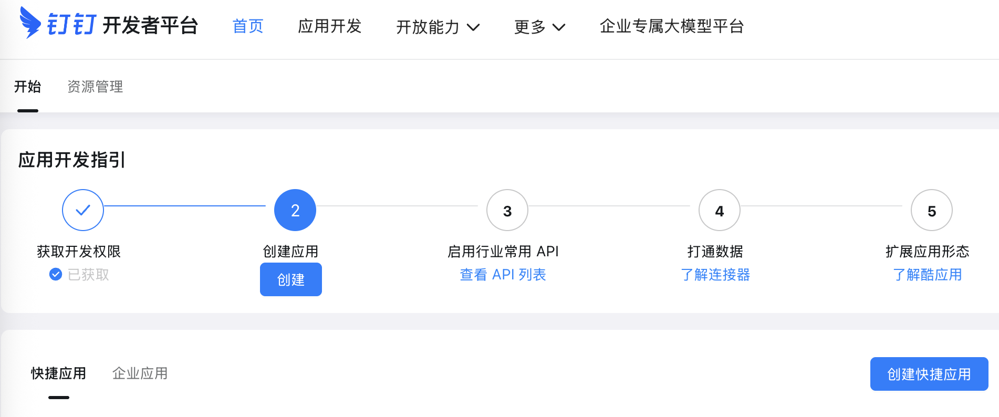
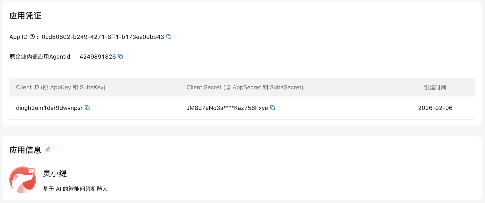
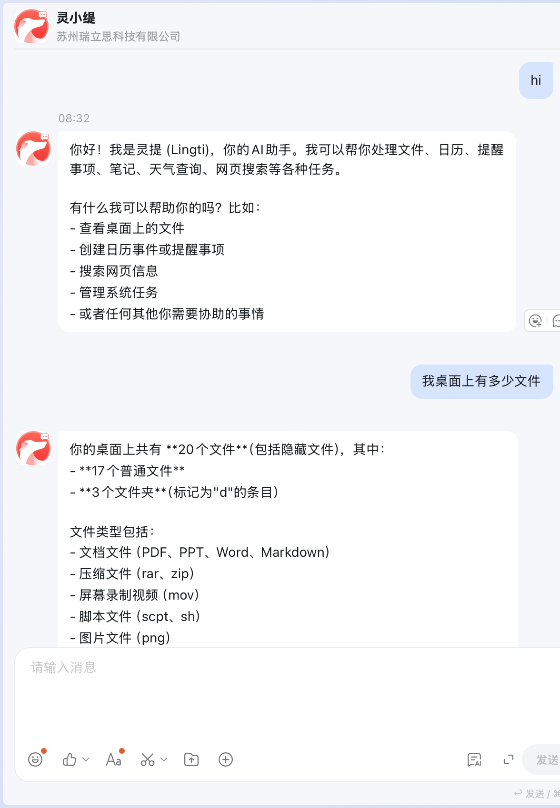

# 钉钉（DingTalk）集成指南

> 本指南介绍如何将 lingti-bot 接入钉钉机器人。

## TL;DR

```bash
# 1. 安装
# macOS / Linux / WSL:
curl -fsSL https://files.lingti.com/install-bot.sh | bash
# Windows (PowerShell):
irm https://cli.lingti.com/install.ps1 -OutFile install.ps1; .\install.ps1 -Bot

# 2. 启动（使用 Stream 模式，无需公网服务器）
export DINGTALK_CLIENT_ID="your-app-key"
export DINGTALK_CLIENT_SECRET="your-app-secret"
export AI_PROVIDER="deepseek"
export AI_API_KEY="sk-xxx"
lingti-bot gateway
```

## 架构图

```
┌─────────────────┐     Stream (WSS)      ┌─────────────────┐
│   钉钉服务器     │ ◄──────────────────► │   lingti-bot    │
│   (DingTalk)    │                       │   (本地运行)     │
└─────────────────┘                       └────────┬────────┘
                                                   │
                                                   ▼
                                          ┌─────────────────┐
                                          │    AI Provider  │
                                          │ (Claude/DeepSeek)│
                                          └─────────────────┘
```

**关键优势**：钉钉使用 Stream 模式（WebSocket），无需公网服务器、无需配置回调 URL。

## 前置条件

1. 钉钉开发者账号
2. 企业内部应用（或第三方企业应用）
3. AI Provider API Key（Claude、DeepSeek 等）

## 配置步骤

### 第一步：创建钉钉应用

1. 登录 [钉钉开发者后台](https://open-dev.dingtalk.com/)
2. 点击顶部导航「应用开发」
3. 在「应用开发指引」中，找到第 2 步「创建应用」，点击「创建」按钮



4. 选择「企业应用」标签页，点击「创建快捷应用」
5. 填写应用信息：
   - 应用名称：如 "灵小缇"
   - 应用描述：如 "基于 AI 的智能问答机器人"
6. 创建完成后，进入应用详情页，在「凭证与基础信息」中找到：
   - **Client ID**（原 AppKey）→ 对应 `DINGTALK_CLIENT_ID`
   - **Client Secret**（原 AppSecret）→ 对应 `DINGTALK_CLIENT_SECRET`



### 第二步：配置机器人能力

1. 在应用详情页，点击「添加应用能力」
2. 选择「机器人」能力
3. 配置机器人信息：
   - 机器人名称
   - 机器人头像
   - 机器人简介

### 第三步：开启 Stream 模式

1. 在「机器人」配置页面
2. 找到「消息接收模式」
3. 选择 **Stream 模式**（推荐）
4. 如果只看到 HTTP 模式，请检查是否有 Stream 模式的入口，或联系钉钉支持

> **注意**：Stream 模式是推荐的接入方式，无需配置公网回调地址。

### 第四步：发布应用

1. 在「版本管理与发布」页面
2. 点击「创建新版本」
3. 填写版本信息
4. 提交发布（内部应用通常无需审核）

### 第五步：配置 lingti-bot

#### 环境变量方式（推荐）

```bash
# 钉钉凭据
export DINGTALK_CLIENT_ID="dingxxxxxx"      # AppKey
export DINGTALK_CLIENT_SECRET="xxxxxxxx"     # AppSecret

# AI 配置
export AI_PROVIDER="deepseek"                # 或 claude、kimi
export AI_API_KEY="sk-xxx"

# 启动
lingti-bot gateway
```

#### 命令行参数方式

```bash
lingti-bot gateway \
  --dingtalk-client-id "dingxxxxxx" \
  --dingtalk-client-secret "xxxxxxxx" \
  --provider deepseek \
  --api-key "sk-xxx"
```

### 第六步：测试机器人

1. 在钉钉客户端中
2. 找到已发布的应用机器人
3. 发送消息测试：
   - **单聊**：直接发送消息
   - **群聊**：@机器人 发送消息

## 效果展示

配置完成后，你可以在钉钉中与机器人对话：



机器人支持多种功能，包括：
- 查看桌面文件
- 创建日历事件或提醒事项
- 搜索网页信息
- 管理系统任务
- 以及其他 AI 助手能力

## 环境变量

| 变量名 | 说明 | 必填 |
|--------|------|------|
| `DINGTALK_CLIENT_ID` | 钉钉应用的 AppKey | ✅ |
| `DINGTALK_CLIENT_SECRET` | 钉钉应用的 AppSecret | ✅ |
| `AI_PROVIDER` | AI 提供商 (claude/deepseek/kimi) | ❌ |
| `AI_API_KEY` | AI API 密钥 | ✅ |
| `AI_BASE_URL` | 自定义 API 地址 | ❌ |
| `AI_MODEL` | 指定模型名称 | ❌ |

## 消息类型支持

| 消息类型 | 接收 | 发送 |
|----------|------|------|
| 文本消息 | ✅ | ✅ |
| Markdown | ❌ | ✅ |
| 图片 | ❌ | ❌ |
| 文件 | ❌ | ❌ |
| 语音 | ❌ | ❌ |

## 常见问题

### 1. 连接失败

**症状**：启动后提示 "failed to start DingTalk stream client"

**排查步骤**：
1. 检查 AppKey 和 AppSecret 是否正确
2. 确认应用已发布
3. 确认已开启 Stream 模式
4. 检查网络是否能访问 `*.dingtalk.com`

### 2. 收不到消息

**症状**：机器人在线但收不到用户消息

**排查步骤**：
1. 确认机器人能力已添加
2. 确认应用版本已发布
3. 群聊场景下，确认用户有 @机器人
4. 检查日志中是否有消息回调

### 3. 群聊中不响应

**症状**：单聊正常，群聊不响应

**原因**：群聊需要 @机器人 才会响应

**解决方案**：在群聊中使用 "@机器人名称 你的问题" 的格式

### 4. 响应超时

**症状**：消息发送后很久才收到回复，或无回复

**可能原因**：
1. AI API 响应慢
2. 网络延迟

**解决方案**：
1. 尝试更换 AI 提供商
2. 检查网络连接
3. 查看 lingti-bot 日志

## 与其他方案对比

| 特性 | lingti-bot | 自建服务 |
|------|------------|----------|
| 公网服务器 | ❌ 不需要 | ✅ 需要 |
| 回调 URL 配置 | ❌ 不需要 | ✅ 需要 |
| Stream 模式 | ✅ 原生支持 | 需自行实现 |
| AI 集成 | ✅ 内置 | 需自行开发 |
| 部署复杂度 | 低 | 高 |

## 安全建议

1. **保护凭据**：不要将 AppKey 和 AppSecret 提交到代码仓库
2. **最小权限**：只申请必要的应用权限
3. **本地运行**：AI API Key 仅在本地使用，不经过第三方服务器
4. **日志脱敏**：生产环境注意日志中不要记录敏感信息

## 相关文档

- [钉钉开发者文档](https://open.dingtalk.com/document/)
- [Stream 模式说明](https://open.dingtalk.com/document/orgapp/stream-mode-introduction)
- [飞书集成指南](feishu-integration.md)
- [企业微信集成指南](wecom-integration.md)
